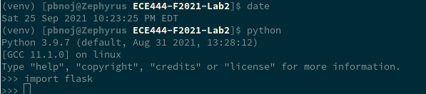
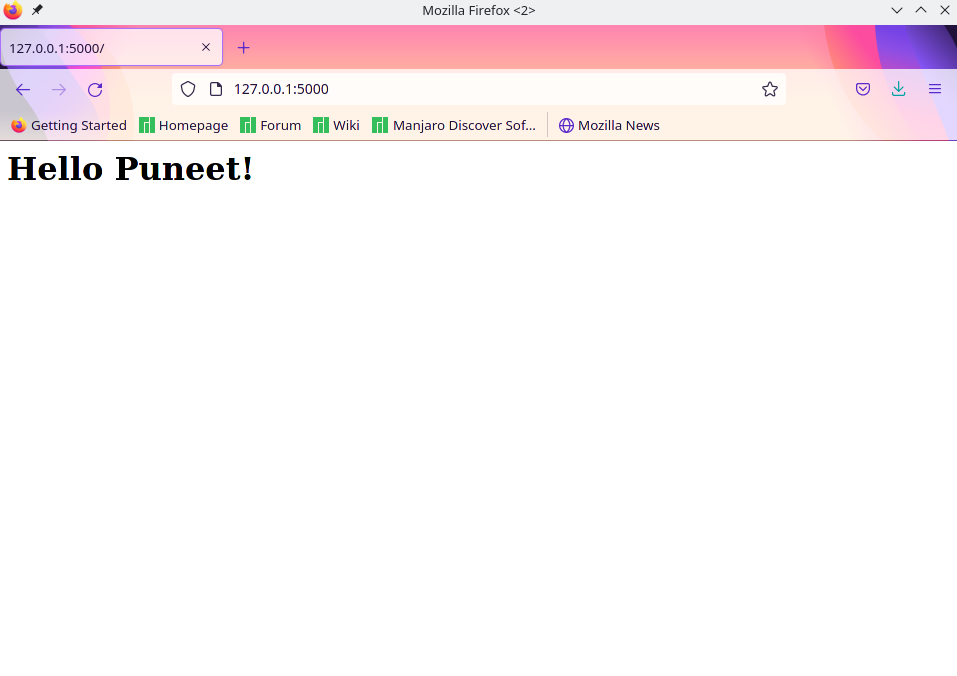
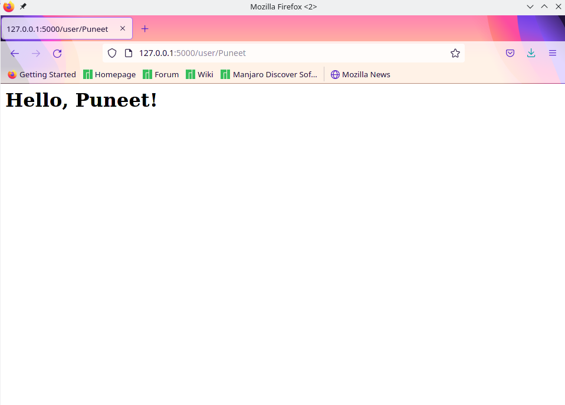
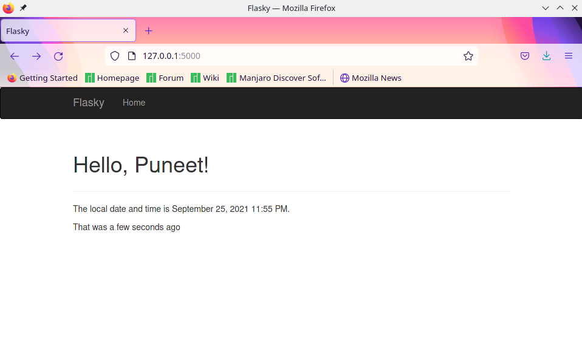
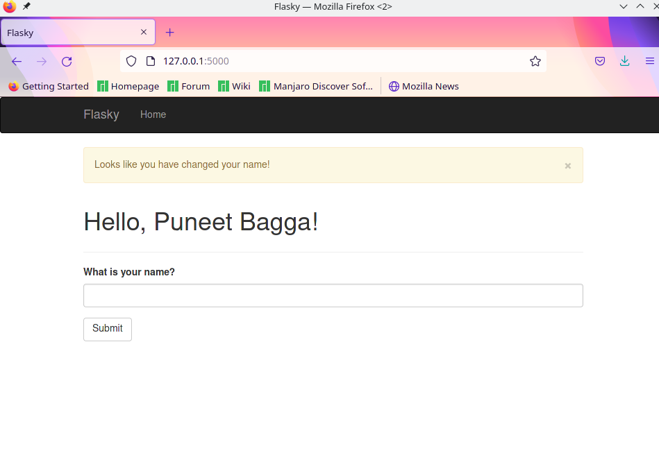
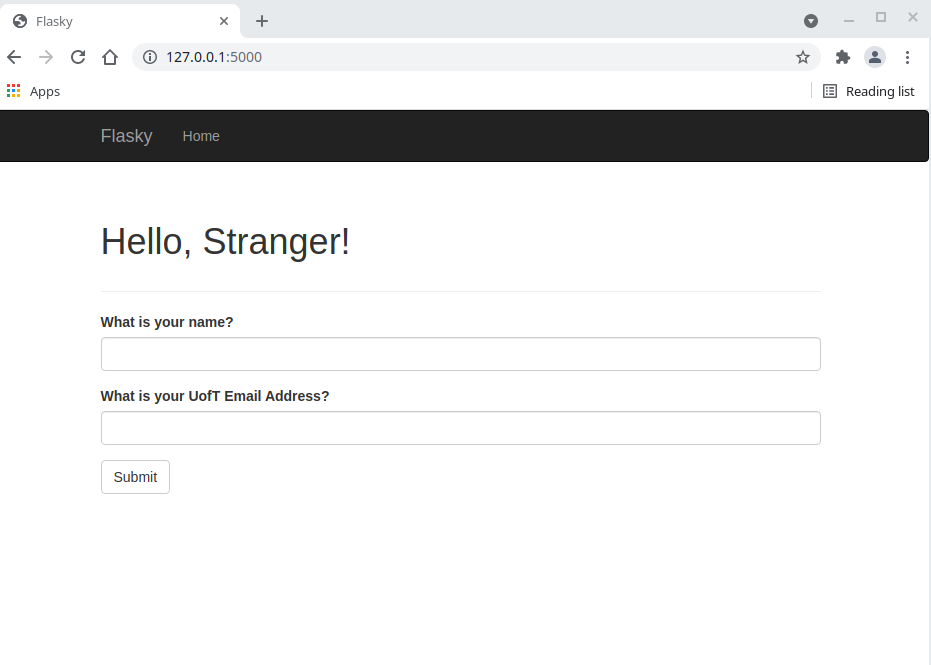
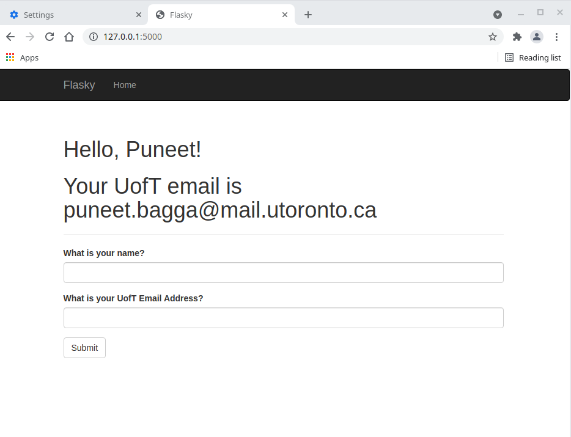
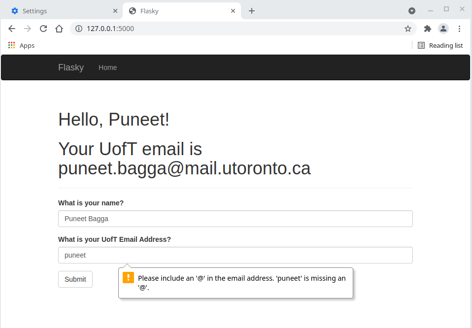

# ECE444-F2021-Lab2
By: Puneet Singh Bagga

NOTE: This repo is a clone of https://github.com/miguelgrinberg/flask

## Activity 1:

## Activity 2 Part 1:

## Activity 2 Part 2:

## Activity 3:

## Activity 4 Part 1:

## Activity 4 Part 2:

## Activity 4 Part 3:

## Activity 4 Part 4:

## Activity 4 Part 5:

